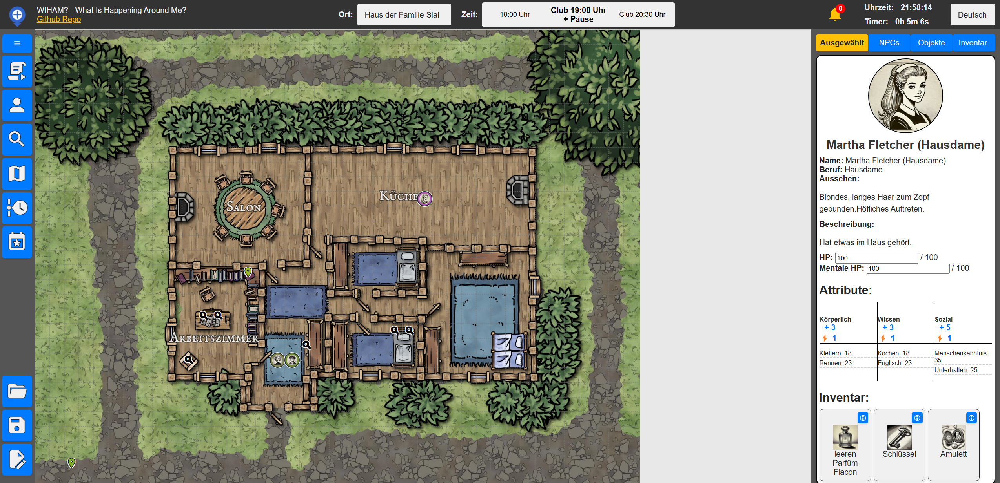

<div style="display: flex; align-items: center;">
  
  <h1>WIHAM? — What Is Happening Around Me?</h1>
</div>

<p align="center">
  <b>An interactive platform to create, manage, and explore your pen-and-paper adventures!</b>
</p>

---

## ✨ Overview
**WIHAM?** is your all-in-one solution for designing immersive pen-and-paper role-playing scenarios. Use it to craft intricate worlds, manage characters, plan events, and keep track of your game universe—all from the comfort of your browser.

<details>
<summary><strong>Why WIHAM?</strong></summary>

- **Collaborative & Flexible**: Perfect for GMs who want to build worlds together or just keep everything organized in one place.
- **Intuitive UI**: With drag-and-drop editing for timelines, locations, and events, you'll be up and running in no time.
- **Export & Import**: Share your unique creations with others or keep them safe in a tidy ZIP file.
- **Multilingual**: Customize language settings for players around the globe.
</details>

---

## 🚀 Features

1. **Scenario Management**  
   \- Seamlessly **import** and **export** entire scenarios as ZIP files.

2. **NPC Editor**  
   \- Create detailed NPC profiles including schedules, stats, and visuals.

3. **Object Editor**  
   \- Position and describe objects; place them on maps or assign them to NPCs.

4. **Location Editor**  
   \- Customize backgrounds, grids, and default images for your in-game locations.

5. **Timeline Editor**  
   \- Organize and reorder events chronologically with drag-and-drop simplicity.

6. **Event Editor**  
   \- Define events with specific trigger conditions (time, location, NPC status).

7. **Multilingual Support**  
   \- Easily switch between languages such as English and German.

8. **Support for Rulesets**  
   \- Show Attributes based on the Ruleset this Adventure is made for

Currently Supported Rulesets are:
- How To Be A Hero (HTBAH)

---

## 🛠 Installation

### Prerequisites
- A modern browser with JavaScript enabled (Chrome, Firefox, Edge, Safari).
- Navigate to [w-i-h-a-m.github.io](https://w-i-h-a-m.github.io/) in your browser.

*Optional: If you want to use it offline, install this page as Application.
<details>
  <summary>MS Edge</summary>
  
</details>
<details>
  <summary>Chrome</summary>
  
</details>

You’re good to go! No extra steps needed.

---

## 📁 Directory Structure

```
WIHAM/
│
├── css/                 # Styles for the user interface
│   └── style.css
├── js/                  # Java Script code
├── assets/              # Default images and icons
├── service-worker.js    # For Offline functionality
├── locales.json         # Language files
└── index.html           # Main application file
```

## 📦 ZIP File Structure

When **exporting** a scenario, you'll get a `.zip` file containing all data:

```
scenario.zip
│
├── meta.json        # Metadata of the scenario (e.g., name, ruleset, creator, plot)
├── npcs.json        # List of non-player characters and their attributes
├── objects.json     # List of objects and their details
├── places.json      # List of locations with grid size and background information
├── timeline.json    # Chronological timeline entries
├── events.json      # List of events with conditions and triggers
└── images/          # Folder containing all images used in the scenario
    ├── npc_<id>.png  # Images for NPCs
    ├── object_<id>.png # Images for objects
    └── place_<id>.png  # Background images for places
```

## 🎮 Usage

### Importing & Exporting
- **Import** scenarios with the **"Import Scenario"** button.
- **Export** scenarios to share them with fellow GMs or back them up.

### Creating Content
- **NPCs**: Give them stats, images, and schedules that govern their behavior.
- **Objects**: Flesh out the world by placing interactive items on the map or assigning them to NPC inventories.
- **Locations**: Define visual settings and grid sizes for your adventure’s maps.
- **Timelines**: Keep events in logical order; re-arrange them as you see fit.
- **Events**: Connect in-game actions to triggers like time, place, or NPC interactions.

### ChatGPT as Assistant
Give ChatGPT you Scenario.zip and this Prompt below. Then you will be able to ask ChatGPT questions about this Adventure. (Tested with ChatGPT 4o)
<details>
<summary><strong>ChatGPT Prompt</strong></summary>

```
I have uploaded a ZIP file containing JSON data that describes a story. The data includes the following elements:

NPCs (Non-Player Characters):
Properties include id, name, profession, appearance, attributes, and schedule.
schedule specifies where (placeId) and when (timeStart) an NPC is located.
Connections between NPCs exist, such as through relationships or references in descriptions (data-id).
Objects:
Contain information like id, name, description, and position.
position links objects to locations (placeId) and coordinates within the location (x, y).
Locations:
Locations are defined by id, name, gridSize, description, and connections to other locations (links).
They contain objects and NPCs present at the location.
Timeline:
Events are chronologically ordered by id, order, and description.
Events:
Events have id, name, and conditions specified by type (npc, place, time).
Conditions define when and how an event is triggered.
Meta Information:
Describes the background story, central themes, and goals of the adventure.
Images:
NPCs, objects, and locations have associated images.
Relationships and Story Context:
NPCs move according to their schedule to specific locations (placeId) and interact with objects or players there.
Objects are positioned in specific locations and can be activated through events (e.g., conditions).
Events are triggered by combinations of time, location, and NPCs.
The timeline connects all elements and determines the order of events.
Task:
Analyze the ZIP file and explain the data structure and relationships between the objects so that I can ask targeted questions about the story, such as:

Where is a specific NPC at a given time?
What objects are located in a particular place?
What events can occur in a location or at a specific time?
How do the meta-information elements influence the story?
Provide me with the ability to directly focus on specific elements (e.g., an NPC or an event).
```
</details>

---

## 🛠 Development

### Local Development
1. Clone or download the WIHAM? repository.
2. Make changes to the `.js` or `.css` files.
3. Use a local server (e.g., Live Server) to see real-time updates.

### Contributions
Pull requests are welcome! Make sure to include tests for any new features to ensure stability.

---

## 📜 License
This project is licensed under the **Creative Commons Attribution-NonCommercial-ShareAlike 4.0 International (CC BY-NC-SA 4.0)** license.  
Please refer to the official [LICENSE](https://creativecommons.org/licenses/by-nc-sa/4.0/) for full details.

---

<p align="center">
  Made with 💖 for passionate GMs and storytellers. Enjoy building your worlds with WIHAM!
</p>